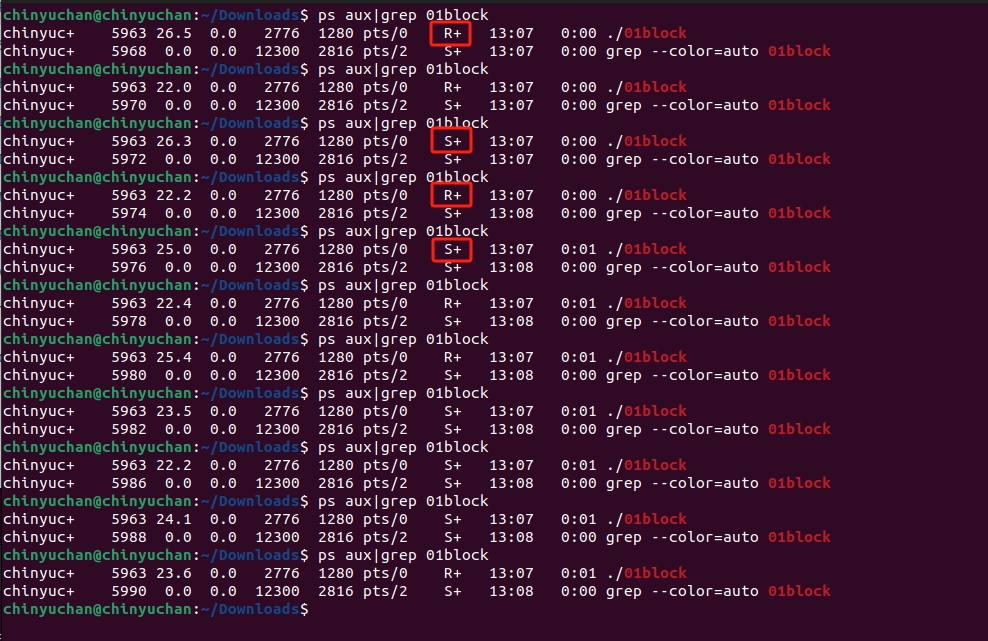
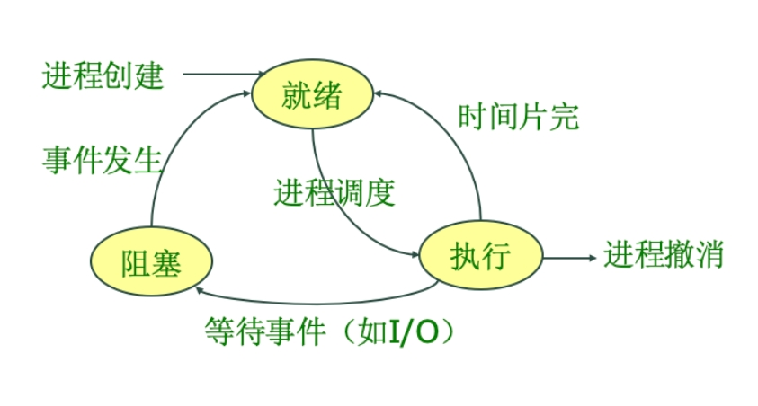

# 阻塞IO

## 为什么会阻塞

## 为什么会阻塞

可以看出，read（未完成）时，进程为睡眠状态`S+`，read之后的代码不能执行，即阻塞。
因为操作系统是从就绪队列中取出进程执行。一旦read完成，进程被放入就绪队列等待执行。当进程执行时状态为`R+`。

## 阻塞IO

阻塞 IO是`read` 和`write`函数的默认执行机制，会在读写操作执行时将进程置为阻塞状态，IO完成后，由系统中断将其置为就绪态，等待执行。
阻塞IO的问题是无法并发的执行IO操作，或无法在执行IO操作时，执行其他代码。

