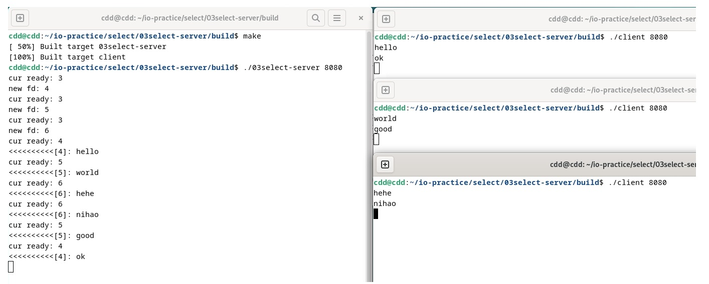

# Select Server
* 通过select来监听一组`readfds`
* 当有新的连接进来时，加入到监听数组`readfds`中
* 当有某个fd就绪时，就做相应的处理

## 缺陷
* 由于`fd_set`的上限是1024，所以select能等待的读事件的文件描述符和写事件的文件描述是有上限的，如果作为一个大型服务器，能够同时链接的客户端是远远不够的。
* 每次应用进程调用一次select之前，都需要重新设定`writefds`和`readfds`，如果进行轮询调用select，这对影响cpu效率。
* 内核每一次等待文件描述符 都会重新扫描所有`readfds`或者`writefds`中的所有文件描述符，如果有较多的文件描述符，则会影响效率。

## 运行效果

